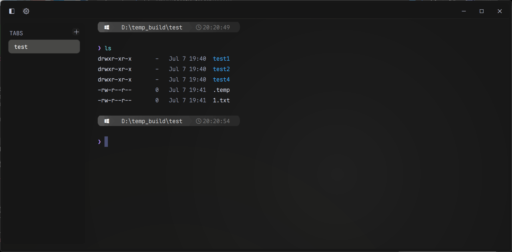
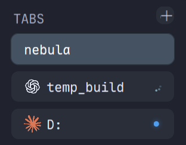
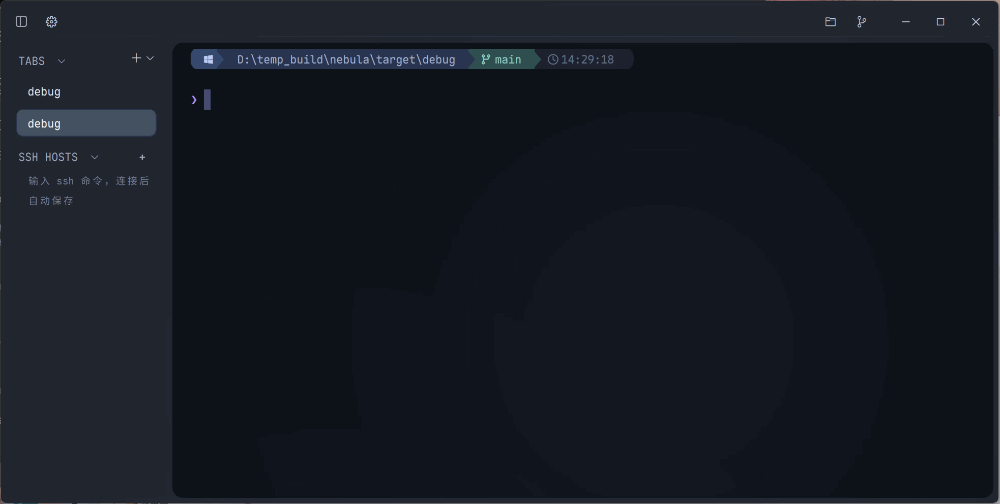

<p align="center">
  
</p>

<h1 align="center">Nebula Terminal</h1>

<p align="center">
  <b>A GPU-accelerated terminal for Windows that keeps your sessions alive — close the window, your <code>claude</code> conversation survives.</b><br/>
  <b>一款 GPU 加速的 Windows 终端：关闭窗口不杀会话，重新打开，你的 <code>claude</code> 对话原样回来。</b>
</p>

<p align="center">
  
  
  
  
  
</p>

<p align="center">
  
  
  
  <a href="https://linux.do"></a>
</p>

<p align="center">
  <a href="#english">English</a> · <a href="#简体中文">简体中文</a>
</p>

<p align="center">
  <!-- 📸 SHOT #1 主视觉：深色 Nebula 主题全窗截图（见 docs/screenshots/SHOTLIST.md） -->
  
</p>

---

## English

### ✨ About

Nebula is a terminal emulator for Windows, built in Rust on a
GPU-accelerated rendering core and designed around one idea: **your terminal
sessions are too valuable to die with a window**. It pairs a tmux-style
resident session model with a glass UI, an AI-CLI-aware sidebar, and a shell
experience that works without extra setup.

### 🚀 Features

**Sessions that survive**

- **Session residency** — closing the window *detaches* instead of killing:
  every PTY (your running `claude`, builds, SSH sessions) keeps running in a
  resident process. Launch Nebula again and the window re-attaches — same
  processes, same scrollback, mid-conversation.
- **Cold session restore** — if the resident process is gone (reboot, crash),
  the next launch still restores your tab layout and per-tab working
  directories from a continuously autosaved snapshot, with a crash-loop
  breaker.
- **Single instance** — a second launch hands over to the running instance
  instead of piling up windows.

**Built for AI-CLI workflows**

<p align="center">
  <!-- 📸 SHOT #3 侧栏特写：claude 星芒 + codex 花结 + 转圈 + 圆点 -->
  
</p>

- **Real brand marks in the sidebar** — a tab running `claude` shows the
  actual Anthropic starburst; `codex` shows the OpenAI blossom, tinted to the
  theme. Other programs get Nerd Font icons (`gemini`, `copilot`, `git`,
  `vim`, `cargo`, …).
- **Live turn state, wired to the source** — Nebula installs Claude Code
  hooks (and Codex notify) pointing at a bundled bridge
  (`nebula-hook.exe`, dependency-free): prompt submitted → spinner; turn
  finished → dot + toast; Claude needs your input → toast carrying the actual
  message text. Delivered over a local named pipe, with no shell integration
  required.
- **Click-to-focus notifications** — every toast knows which pane raised it:
  click one and Nebula comes to the foreground, switches to that tab and
  focuses that split.
- **Zero setup, self-healing** — the hook entries install on first boot and
  re-install themselves if a config switcher rewrites the file (a watcher on
  the config directory re-applies them). Scoped by environment: claude
  running in any other terminal is untouched. `nebula setup-ai --remove`
  undoes everything.
- **Plays nice with existing notifiers** — codex has a single notify slot;
  Nebula wraps it (`--chain`) instead of stealing it, so a pre-existing
  notifier keeps firing.
- **Fallback signals** — OSC 133 command tracking + BEL still cover every
  other CLI: long builds toast on completion, with their duration.
- **Native SSH sessions** — saved hosts open directly through Nebula's Rust SSH
  transport: no wrapper shell and no external console window. Host aliases,
  usernames, ports and identity files are resolved from `~/.ssh/config`;
  authentication supports standard private keys and certificates, encrypted-key
  passphrases, Windows Credential Manager passwords, and keyboard-interactive/MFA.
  Accepted host keys use the standard `known_hosts` store, and additional tabs
  reuse an already authenticated
  connection to the same `user@host:port` for a faster second shell.
- **Built-in SFTP transfers** — open a remote file drawer from any saved SSH
  host and reuse its authenticated connection. Browse or type remote paths,
  filter entries, upload and download files or folders, create and rename
  folders, recursively delete, follow symlink targets, and cancel transfers
  with visible progress and errors.
- **AI-aware over SSH** — remote Hook envelopes can return through a
  per-channel, randomly authenticated private OSC bridge. Nebula validates the
  channel token, replaces any remote pane identifier with the local pane, and
  routes the event through the existing sidebar and Windows notification path.
  The `nebula ssh` compatibility command remains available for forwarding,
  query and explicit-command forms that need the system SSH client.

<p align="center">
  
</p>

**Performance & correctness**

- **Instrumented startup** — the boot path is fully traceable
  (`NEBULA_BOOT_TRACE=1`); no shell profile is loaded and history loads
  lazily.
- **Modern ConPTY host** — ships the side-by-side ConPTY host for correct
  resize behavior, with its startup handshake (DA1) pre-primed so a new tab
  doesn't stall on that round-trip.
- **Coalesced resizing** — interactive drags resize the grid only; the PTY
  learns its final size once, so full-screen TUIs don't smear redraws into
  scrollback.

**Shell experience**

- **Inline ghost-text completions** — fish-style dim suggestions from command
  history and filesystem paths; accept with `→` or `Tab`.
- **Persistent indexed history** — commands stored as JSONL under
  `%APPDATA%\Nebula`, shared across sessions, with prefix hints.
- **Powerline prompt built in** — themed gradient prompt with git branch and
  clock, for PowerShell and Git Bash, no plugins to install.
- **Quality-of-life fixes** — unquoted `cd D:/Program Files` just works, bare
  `$env:KEY=value` assignments are auto-quoted, `ls` gets colors and
  clickable OSC 8 hyperlinks.

**Interface**

<p align="center">
  <!-- 📸 SHOT #5 主题拼图：设置面板主题卡或三窗拼图（一深一浅一 Nebula） -->
  
</p>

- **Glass chrome & seven themes** — Nebula plus three matched light/dark
  pairs: Silver Light / Steel Dark, Limestone / Coal Dark, Linen Light /
  Moss Dark. One skin system drives chrome, prompt and dialogs; every theme
  persists across restarts.
- **Tabs & splits** — sidebar tabs with drag-to-reorder and drag-to-dock into
  splits; unfocused panes dim instead of growing borders.
- **Files, Git and SFTP drawers** — browse local or remote files without
  leaving the terminal. The Git drawer can stage, commit, pull fast-forward
  updates, and push.
- **Quick terminal** — global <kbd>Ctrl</kbd>+<kbd>`</kbd> drops a Quake-style
  terminal from the top edge.
- **Settings tab & command palette** — settings opens as a normal reusable tab,
  with themes, language, background image/opacity, shell choice and completion
  behavior; all persisted.
- **Inline images** — OSC 1337 image protocol support, lazily anchored to
  scrollback rows.

### 📥 Install

> **⚠️ Install the bundled font first.** Nebula's powerline prompt, program
> icons and AI brand marks are drawn with **Maple Mono Normal NF CN** (a Nerd Font).
> Nebula embeds the same font as a runtime fallback so forgetting to install it
> no longer breaks the interface, but a normal system installation is still the
> intended setup. The font ships in the release zip under `fonts/` and the repo at
> `assets/fonts/MapleMonoNormal-NF-CN-Regular.ttf` — double-click
> it and press **Install**, then launch Nebula. Nebula checks the font on every
> launch; if the system font is missing, a dismissible reminder can open the
> bundled `fonts/` folder. Install the font and restart Nebula for the complete
> icon set. (Licensed under SIL OFL 1.1.)

**Release build (recommended)** — download
`NebulaTerminal-v0.4.0-windows-x64.zip` from
[Releases](https://github.com/Kuddev/nebula/releases), unzip
anywhere, install `fonts/MapleMonoNormal-NF-CN-Regular.ttf`, then run
`nebula.exe`. Keep the extracted folders in place: AI and ConPTY helpers live
under `runtime/`, while fonts, documentation, and notices live under `fonts/`,
`docs/`, and `licenses/`.

**From source**

```powershell
cargo build --release   # artifacts land in target/release/
```

### Lua Configuration

Nebula ships a vendored Lua 5.4 runtime with `require 'nebula'` and
`nebula.config_builder()`. Generate an annotated template with
`nebula config init --language system|zh-CN|en-US`, then validate it without
opening the GUI using `nebula config check`. Module `require` paths participate
in live reload; invalid edits keep the last-known-good configuration active.
Existing TOML files remain supported. See the
[Lua configuration guide](docs/lua-configuration.md) for APIs, discovery order,
Windows/Linux paths, arrays, modules, and reload behavior.

See [Product positioning](docs/product-positioning.md) for Nebula's target
users, core scenarios, and its tradeoffs against Warp, kitty, Tabby and WezTerm.

### 🧩 Tech Stack

| Layer | Tech |
| --- | --- |
| Language | Rust (2024 edition) |
| Rendering | OpenGL / OpenGL ES 2.0+, custom glyph & UI quad renderers |
| Terminal core | GPU-resident grid + VTE escape-sequence parsing |
| Session model | Resident mux process, loopback attach protocol |
| Shell integration | PowerShell + PSReadLine, Git Bash; OSC 7/8/9/133/1337 |
| Fonts | Maple Mono Normal NF CN (Nerd Font glyphs, CJK-aware) |

### 📦 Requirements

- At least OpenGL ES 2.0
- Windows 10 (1809+) / 11 with ConPTY support

### Contact

Questions and feedback: [fickleheartedkeys@163.com](mailto:fickleheartedkeys@163.com)

### 📜 License

Released under the [GNU General Public License v3.0](LICENSE).

---

## 简体中文

### ✨ 简介

Nebula 是一款 Windows 上的终端模拟器，以 Rust 编写，构建在 GPU 加速渲染
内核之上，并围绕一个理念设计：**终端会话太宝贵，不该随窗口一起消失**。它
把 tmux 式的常驻会话模型、玻璃质感界面、AI CLI 感知侧边栏和无需额外配置
的 shell 体验组合在一起。

### 🚀 功能特性

**会话永生**

- **会话驻留** — 关闭窗口是*分离*而不是杀死：所有 PTY（正在跑的
  `claude`、构建、SSH）继续在常驻进程里运行。再次启动 Nebula，窗口原样接回
  —— 同样的进程、同样的回滚缓冲、对话进行到一半也不丢。
- **冷恢复** — 常驻进程不在了（重启、崩溃）也没关系：下次启动从持续自动保
  存的快照恢复标签布局和每个标签的工作目录，并带崩溃循环保护。
- **单实例** — 重复启动会交棒给运行中的实例，不会堆一堆窗口。

**为 AI CLI 工作流而生**

<p align="center">
  <!-- 📸 SHOT #3（同上）侧栏特写 -->
  
</p>

- **侧栏显示真品牌标识** — 跑 `claude` 的标签显示 Anthropic 珊瑚星芒，
  `codex` 显示 OpenAI 花结（贴图渲染、跟随主题染色）；其余程序用
  Nerd Font 图标（`gemini`、`copilot`、`git`、`vim`、`cargo`……）。
- **回合状态实时直连** — Nebula 自动安装 Claude Code hooks（及 Codex
  notify），指向随包的桥接器 `nebula-hook.exe`（无第三方依赖）：
  提交 prompt → 转圈；回合完成 → 圆点 + 通知；claude 要你确认 → 通知里
  带消息原文。经本地命名管道传递，无需任何 shell 集成。
- **通知点击直达** — 每条 toast 都知道自己来自哪个 pane：点一下，Nebula
  前置、切到那个标签、聚焦那个分屏。
- **零配置、自愈合** — hook 条目首次启动自动写入；被配置切换工具覆盖后
  会自动补回（配置目录上有监视器重新写入）。作用域由环境变量限定：其他
  终端里的 claude 完全不受影响。`nebula setup-ai --remove` 一键撤销。
- **不抢占已有 notifier** — codex 只有一个 notify 槽位，Nebula 用
  `--chain` 包装而非顶掉：原有通知程序照常触发。
- **兜底信号** — OSC 133 命令跟踪 + BEL 覆盖其余所有 CLI：长构建完成也
  弹通知，并带耗时。
- **原生 SSH 会话** — 保存的主机现在直接通过 Nebula 的 Rust SSH 传输连接，
  不再经过包装 Shell，也不会弹出外部控制台窗口。主机别名、用户名、端口和
  IdentityFile 会从 `~/.ssh/config` 解析；认证覆盖标准私钥与证书、加密密钥
  口令、Windows 凭据管理器密码以及 keyboard-interactive/MFA。主机密钥写入
  标准 `known_hosts`；同一 `user@host:port` 再开标签页会复用已认证连接，让第二个
  Shell 更快出现。
- **内置 SFTP 传输** — 从已保存 SSH 主机即可打开远端文件抽屉，并复用已认证
  连接。支持浏览或手动输入远端路径、筛选、上传/下载文件与文件夹、新建与重命名
  文件夹、递归删除、跟随符号链接目标，以及带进度、取消和错误提示的后台传输。
- **SSH 里也 AI 感知** — 远端 Hook 信封可通过每通道随机认证的私有 OSC 桥
  返回。Nebula 会校验通道令牌，用本地 Pane 身份覆盖远端字段，再复用现有侧栏
  状态和 Windows 通知链路。需要端口转发、配置查询或显式远程命令时，仍可使用
  `nebula ssh` 兼容命令交给系统 SSH 客户端处理。

<p align="center">
  
</p>

**性能与正确性**

- **启动全程可观测** — 启动路径全程打点（`NEBULA_BOOT_TRACE=1`），不加载
  shell profile，历史惰性加载。
- **现代 ConPTY 宿主** — 内置 side-by-side ConPTY 宿主保证 resize 行为正确，
  并预热其启动握手（DA1），让新标签不必卡在这一次往返上。
- **合并式 resize** — 拖动窗口时只调整网格，PTY 在拖动结束后一次性获知最终
  尺寸，全屏 TUI 不会把重绘刷进历史。

**Shell 体验**

- **行内幽灵补全** — fish 风格暗色建议，来自命令历史与文件路径，
  `→` 或 `Tab` 接受。
- **持久化索引历史** — 命令以 JSONL 存于 `%APPDATA%\Nebula`，跨会话共享，
  提供前缀提示。
- **内置 powerline 提示符** — 主题化渐变提示符，含 git 分支与时钟，
  PowerShell 与 Git Bash 皆可用，无需安装任何插件。
- **顺手的小修正** — 不带引号的 `cd D:/Program Files` 直接可用，裸
  `$env:KEY=value` 自动加引号，`ls` 带颜色和可点击的 OSC 8 超链接。

**界面**

<p align="center">
  <!-- 📸 SHOT #5（同上）主题拼图 -->
  
</p>

- **玻璃质感与七套主题** — Nebula + 三对明暗成组主题：Silver Light /
  Steel Dark、Limestone / Coal Dark、Linen Light / Moss Dark。一套皮肤
  系统驱动 chrome、提示符与弹窗，主题选择跨重启持久化。
- **标签与分屏** — 侧边栏标签支持拖拽排序、拖入终端区四方位分屏；非焦点
  面板压暗而非描边。
- **文件、Git 与 SFTP 抽屉** — 不离开终端即可浏览本地或远端文件；Git 抽屉
  支持暂存、提交、仅快进拉取和推送。
- **快速终端** — 全局 <kbd>Ctrl</kbd>+<kbd>`</kbd> 从屏幕顶部滑出
  Quake 式终端。
- **设置标签页与命令面板** — 设置像普通标签页一样打开和复用，支持主题、
  跟随系统/简体中文/English、背景图/透明度、Shell 与补全行为，并跨重启持久化。
- **行内图片** — 支持 OSC 1337 图片协议，惰性锚定到回滚行。

### 📥 安装

> **⚠️ 请先安装随附字体。** Nebula 的 powerline 提示符、程序图标与 AI 品牌
> 标识都用 **Maple Mono Normal NF CN**（一款 Nerd Font）绘制。Nebula 已把同一字体
> 内置为运行时兜底，忘记安装也不会再让界面显示异常，但正常使用仍建议安装到系统。
> 字体在 release 包内、仓库里也有：
> `assets/fonts/MapleMonoNormal-NF-CN-Regular.ttf`；压缩包内位于 `fonts/` ——
> 双击它点**安装**，再启动
> Nebula。Nebula 每次启动都会检查系统字体；如果还没有正确安装，会显示一个
> 可关闭的提醒，并提供“打开字体文件夹”按钮。安装完成后重启 Nebula 即可显示完整图
> 标。（SIL OFL 1.1 许可。）

**Release 包（推荐）** — 从
[Releases](https://github.com/Kuddev/nebula/releases) 下载
`NebulaTerminal-v0.4.0-windows-x64.zip`，解压到任意目录，先安装
`fonts/MapleMonoNormal-NF-CN-Regular.ttf`，再运行 `nebula.exe`。请保持解压后的
目录结构不变：AI 通知与 ConPTY 组件位于 `runtime/`，字体、文档和许可说明分别
位于 `fonts/`、`docs/` 与 `licenses/`。

**从源码构建**

```powershell
cargo build --release   # 产物在 target/release/
```

### Lua 配置

Nebula 内置 Lua 5.4，使用 `require 'nebula'` 与
`nebula.config_builder()`。运行
`nebula config init --language system|zh-CN|en-US` 可生成带完整注释的模板，
`nebula config check` 可在不启动 GUI 的情况下检查语法与字段。通过 `require`
载入的模块会参与热重载；配置错误时继续使用上一份有效配置。已有 TOML 仍兼容。
路径优先级、Windows/Linux 位置、数组、模块与重载说明见
[Lua 配置指南](docs/lua-configuration.md)。

Nebula 的目标用户、核心场景，以及相对 Warp、kitty、Tabby、WezTerm 的取舍，
见[产品定位文档](docs/product-positioning.md)。

### 🧩 技术栈

| 层级 | 技术 |
| --- | --- |
| 语言 | Rust（2024 edition） |
| 渲染 | OpenGL / OpenGL ES 2.0+，自定义字形与 UI 四边形渲染器 |
| 终端内核 | GPU 常驻网格 + VTE 转义序列解析 |
| 会话模型 | 常驻 mux 进程，环回 attach 协议 |
| Shell 集成 | PowerShell + PSReadLine、Git Bash；OSC 7/8/9/133/1337 |
| 字体 | Maple Mono Normal NF CN（Nerd Font 图标，支持 CJK） |

### 📦 环境要求

- 至少 OpenGL ES 2.0
- Windows 10（1809+）/ 11，需 ConPTY 支持

### 联系方式

问题与反馈：[fickleheartedkeys@163.com](mailto:fickleheartedkeys@163.com)

### 📜 许可证

基于 [GNU 通用公共许可证 v3.0（GPL-3.0）](LICENSE) 发布。

---

## 🔗 友情链接 / Community

- **[linux.do](https://linux.do)** — 新的理想型社区 / a thriving developer community.

---

## ⭐ Star History

<a href="https://star-history.com/#Kuddev/nebula&Date">
  <picture>
    <source media="(prefers-color-scheme: dark)" srcset="https://api.star-history.com/svg?repos=Kuddev/nebula&type=Date&theme=dark" />
    <source media="(prefers-color-scheme: light)" srcset="https://api.star-history.com/svg?repos=Kuddev/nebula&type=Date" />
    
  </picture>
</a>
