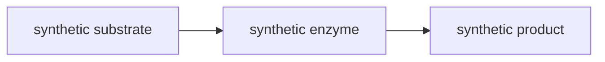

# 生物科研渲染回归文档

这些是小体积、可重复的验证材料；不是一次打开 100 MB 或启动 80 个 AI 的压力脚本。测试直接读取本文件中的数学和 SMILES 块。先在单窗口验证，再采用受限的模型测试验证多会话和总预算。不要为测试自动请求真实 AI 服务。

公式块应作为普通数学成功渲染；FASTA、FASTQ、序列比对、Newick、GFF、BED、PDB 和 Mermaid 只作为可复制源码对照。所有序列、注释、坐标和通路名称都是合成夹具，不是实验数据或研究发现。

每次检查：往返滚动、反复拖选文字、连续改变窗口宽高、切换标签后返回、切换主题；记录有无丢图、闪烁、错误重绘、选区错位和内存持续增长。看到不支持的语法时应保留源码，不能悄悄生成错误科学图形。

## 能力边界

动力学、概率和统计公式使用通用数学渲染，小分子代谢物使用 SMILES。FASTA、序列比对和蛋白质三维结构当前没有专用解析器，下面的代码块应保持可复制文本；不能把普通代码高亮误认为生物结构渲染。

矩阵、信息熵和常见生物小分子也只使用已有的数学或单分子 SMILES 路径；多序列、树、注释和通路不会被伪装成图形。

## 米氏方程

$$
v=\frac{V_{\max}[S]}{K_m+[S]}
$$

## Hill 方程

$$
\theta=\frac{[L]^n}{K_d^n+[L]^n}
$$

## Logistic 增长

$$
\frac{dN}{dt}=rN\left(1-\frac{N}{K}\right)
$$

## Hardy–Weinberg 关系

$$
p+q=1\qquad p^2+2pq+q^2=1
$$

## 序列文本对照

```fasta
>synthetic_fixture_not_a_real_sample
ACGTACGTACGTACGT
```

```text
fixture_A  ACGTACGT--ACGT
fixture_B  ACGTACGTTTACGT
```

## 混合长文与代谢物

下面是渲染与缓存负载材料，参数编号仅用来制造不同表达式。序列片段是合成占位数据，不含患者或真实实验数据。

### 观察窗口 01

第 1 组记录：比较中文段落、英文 protein / metabolite 标签、公式基线和结构图之间的间距。连续拖拽选区跨过这一段，随后缩放窗口并滚回前文，原始序列和公式的复制结果应稳定。

$$
v_{1}=\frac{V_{\max,1}[S]}{K_{m,1}+[S]}\qquad P(X=1)=\frac{\lambda^{1}e^{-\lambda}}{1!}
$$

代谢物/化学结构测试条目：乙醇。

```smiles
CCO
```

```fasta
>synthetic_fragment_01
ACGTACGTACGTACGTACGTACGTACGTACGTACGT
```


### 观察窗口 02

第 2 组记录：比较中文段落、英文 protein / metabolite 标签、公式基线和结构图之间的间距。连续拖拽选区跨过这一段，随后缩放窗口并滚回前文，原始序列和公式的复制结果应稳定。

$$
v_{2}=\frac{V_{\max,2}[S]}{K_{m,2}+[S]}\qquad P(X=2)=\frac{\lambda^{2}e^{-\lambda}}{2!}
$$

代谢物/化学结构测试条目：苯。

```smiles
c1ccccc1
```

```fasta
>synthetic_fragment_02
ACGTACGTACGTACGTACGTACGTACGTACGTACGTACGT
```


### 观察窗口 03

第 3 组记录：比较中文段落、英文 protein / metabolite 标签、公式基线和结构图之间的间距。连续拖拽选区跨过这一段，随后缩放窗口并滚回前文，原始序列和公式的复制结果应稳定。

$$
v_{3}=\frac{V_{\max,3}[S]}{K_{m,3}+[S]}\qquad P(X=3)=\frac{\lambda^{3}e^{-\lambda}}{3!}
$$

代谢物/化学结构测试条目：阿司匹林。

```smiles
CC(=O)Oc1ccccc1C(=O)O
```

```fasta
>synthetic_fragment_03
ACGTACGTACGTACGTACGTACGTACGTACGTACGTACGTACGT
```


### 观察窗口 04

第 4 组记录：比较中文段落、英文 protein / metabolite 标签、公式基线和结构图之间的间距。连续拖拽选区跨过这一段，随后缩放窗口并滚回前文，原始序列和公式的复制结果应稳定。

$$
v_{4}=\frac{V_{\max,4}[S]}{K_{m,4}+[S]}\qquad P(X=4)=\frac{\lambda^{4}e^{-\lambda}}{4!}
$$

代谢物/化学结构测试条目：咖啡因。

```smiles
Cn1c(=O)c2c(ncn2C)n(C)c1=O
```

```fasta
>synthetic_fragment_04
ACGTACGTACGTACGTACGTACGTACGTACGTACGTACGTACGTACGT
```


### 观察窗口 05

第 5 组记录：比较中文段落、英文 protein / metabolite 标签、公式基线和结构图之间的间距。连续拖拽选区跨过这一段，随后缩放窗口并滚回前文，原始序列和公式的复制结果应稳定。

$$
v_{5}=\frac{V_{\max,5}[S]}{K_{m,5}+[S]}\qquad P(X=5)=\frac{\lambda^{5}e^{-\lambda}}{5!}
$$

代谢物/化学结构测试条目：甘氨酸。

```smiles
NCC(=O)O
```

```fasta
>synthetic_fragment_05
ACGTACGTACGTACGTACGTACGTACGTACGTACGTACGTACGTACGTACGT
```


### 观察窗口 06

第 6 组记录：比较中文段落、英文 protein / metabolite 标签、公式基线和结构图之间的间距。连续拖拽选区跨过这一段，随后缩放窗口并滚回前文，原始序列和公式的复制结果应稳定。

$$
v_{6}=\frac{V_{\max,6}[S]}{K_{m,6}+[S]}\qquad P(X=6)=\frac{\lambda^{6}e^{-\lambda}}{6!}
$$

代谢物/化学结构测试条目：乙酸。

```smiles
CC(=O)O
```

```fasta
>synthetic_fragment_06
ACGTACGTACGTACGTACGTACGTACGTACGTACGTACGTACGTACGTACGTACGT
```


### 观察窗口 07

第 7 组记录：比较中文段落、英文 protein / metabolite 标签、公式基线和结构图之间的间距。连续拖拽选区跨过这一段，随后缩放窗口并滚回前文，原始序列和公式的复制结果应稳定。

$$
v_{7}=\frac{V_{\max,7}[S]}{K_{m,7}+[S]}\qquad P(X=7)=\frac{\lambda^{7}e^{-\lambda}}{7!}
$$

代谢物/化学结构测试条目：氯化铵。

```smiles
[NH4+].[Cl-]
```

```fasta
>synthetic_fragment_07
ACGTACGTACGTACGTACGTACGTACGTACGTACGTACGTACGTACGTACGTACGTACGT
```


### 观察窗口 08

第 8 组记录：比较中文段落、英文 protein / metabolite 标签、公式基线和结构图之间的间距。连续拖拽选区跨过这一段，随后缩放窗口并滚回前文，原始序列和公式的复制结果应稳定。

$$
v_{8}=\frac{V_{\max,8}[S]}{K_{m,8}+[S]}\qquad P(X=8)=\frac{\lambda^{8}e^{-\lambda}}{8!}
$$

代谢物/化学结构测试条目：萘。

```smiles
c1ccc2ccccc2c1
```

```fasta
>synthetic_fragment_08
ACGTACGTACGTACGTACGTACGTACGTACGT
```


### 观察窗口 09

第 9 组记录：比较中文段落、英文 protein / metabolite 标签、公式基线和结构图之间的间距。连续拖拽选区跨过这一段，随后缩放窗口并滚回前文，原始序列和公式的复制结果应稳定。

$$
v_{9}=\frac{V_{\max,9}[S]}{K_{m,9}+[S]}\qquad P(X=9)=\frac{\lambda^{9}e^{-\lambda}}{9!}
$$

代谢物/化学结构测试条目：乙醇。

```smiles
CCO
```

```fasta
>synthetic_fragment_09
ACGTACGTACGTACGTACGTACGTACGTACGTACGT
```


### 观察窗口 10

第 10 组记录：比较中文段落、英文 protein / metabolite 标签、公式基线和结构图之间的间距。连续拖拽选区跨过这一段，随后缩放窗口并滚回前文，原始序列和公式的复制结果应稳定。

$$
v_{10}=\frac{V_{\max,10}[S]}{K_{m,10}+[S]}\qquad P(X=10)=\frac{\lambda^{10}e^{-\lambda}}{10!}
$$

代谢物/化学结构测试条目：苯。

```smiles
c1ccccc1
```

```fasta
>synthetic_fragment_10
ACGTACGTACGTACGTACGTACGTACGTACGTACGTACGT
```


### 观察窗口 11

第 11 组记录：比较中文段落、英文 protein / metabolite 标签、公式基线和结构图之间的间距。连续拖拽选区跨过这一段，随后缩放窗口并滚回前文，原始序列和公式的复制结果应稳定。

$$
v_{11}=\frac{V_{\max,11}[S]}{K_{m,11}+[S]}\qquad P(X=11)=\frac{\lambda^{11}e^{-\lambda}}{11!}
$$

代谢物/化学结构测试条目：阿司匹林。

```smiles
CC(=O)Oc1ccccc1C(=O)O
```

```fasta
>synthetic_fragment_11
ACGTACGTACGTACGTACGTACGTACGTACGTACGTACGTACGT
```


### 观察窗口 12

第 12 组记录：比较中文段落、英文 protein / metabolite 标签、公式基线和结构图之间的间距。连续拖拽选区跨过这一段，随后缩放窗口并滚回前文，原始序列和公式的复制结果应稳定。

$$
v_{12}=\frac{V_{\max,12}[S]}{K_{m,12}+[S]}\qquad P(X=12)=\frac{\lambda^{12}e^{-\lambda}}{12!}
$$

代谢物/化学结构测试条目：咖啡因。

```smiles
Cn1c(=O)c2c(ncn2C)n(C)c1=O
```

```fasta
>synthetic_fragment_12
ACGTACGTACGTACGTACGTACGTACGTACGTACGTACGTACGTACGT
```


### 观察窗口 13

第 13 组记录：比较中文段落、英文 protein / metabolite 标签、公式基线和结构图之间的间距。连续拖拽选区跨过这一段，随后缩放窗口并滚回前文，原始序列和公式的复制结果应稳定。

$$
v_{13}=\frac{V_{\max,13}[S]}{K_{m,13}+[S]}\qquad P(X=13)=\frac{\lambda^{13}e^{-\lambda}}{13!}
$$

代谢物/化学结构测试条目：甘氨酸。

```smiles
NCC(=O)O
```

```fasta
>synthetic_fragment_13
ACGTACGTACGTACGTACGTACGTACGTACGTACGTACGTACGTACGTACGT
```


### 观察窗口 14

第 14 组记录：比较中文段落、英文 protein / metabolite 标签、公式基线和结构图之间的间距。连续拖拽选区跨过这一段，随后缩放窗口并滚回前文，原始序列和公式的复制结果应稳定。

$$
v_{14}=\frac{V_{\max,14}[S]}{K_{m,14}+[S]}\qquad P(X=14)=\frac{\lambda^{14}e^{-\lambda}}{14!}
$$

代谢物/化学结构测试条目：乙酸。

```smiles
CC(=O)O
```

```fasta
>synthetic_fragment_14
ACGTACGTACGTACGTACGTACGTACGTACGTACGTACGTACGTACGTACGTACGT
```


### 观察窗口 15

第 15 组记录：比较中文段落、英文 protein / metabolite 标签、公式基线和结构图之间的间距。连续拖拽选区跨过这一段，随后缩放窗口并滚回前文，原始序列和公式的复制结果应稳定。

$$
v_{15}=\frac{V_{\max,15}[S]}{K_{m,15}+[S]}\qquad P(X=15)=\frac{\lambda^{15}e^{-\lambda}}{15!}
$$

代谢物/化学结构测试条目：氯化铵。

```smiles
[NH4+].[Cl-]
```

```fasta
>synthetic_fragment_15
ACGTACGTACGTACGTACGTACGTACGTACGTACGTACGTACGTACGTACGTACGTACGT
```


### 观察窗口 16

第 16 组记录：比较中文段落、英文 protein / metabolite 标签、公式基线和结构图之间的间距。连续拖拽选区跨过这一段，随后缩放窗口并滚回前文，原始序列和公式的复制结果应稳定。

$$
v_{16}=\frac{V_{\max,16}[S]}{K_{m,16}+[S]}\qquad P(X=16)=\frac{\lambda^{16}e^{-\lambda}}{16!}
$$

代谢物/化学结构测试条目：萘。

```smiles
c1ccc2ccccc2c1
```

```fasta
>synthetic_fragment_16
ACGTACGTACGTACGTACGTACGTACGTACGT
```


### 观察窗口 17

第 17 组记录：比较中文段落、英文 protein / metabolite 标签、公式基线和结构图之间的间距。连续拖拽选区跨过这一段，随后缩放窗口并滚回前文，原始序列和公式的复制结果应稳定。

$$
v_{17}=\frac{V_{\max,17}[S]}{K_{m,17}+[S]}\qquad P(X=17)=\frac{\lambda^{17}e^{-\lambda}}{17!}
$$

代谢物/化学结构测试条目：乙醇。

```smiles
CCO
```

```fasta
>synthetic_fragment_17
ACGTACGTACGTACGTACGTACGTACGTACGTACGT
```


### 观察窗口 18

第 18 组记录：比较中文段落、英文 protein / metabolite 标签、公式基线和结构图之间的间距。连续拖拽选区跨过这一段，随后缩放窗口并滚回前文，原始序列和公式的复制结果应稳定。

$$
v_{18}=\frac{V_{\max,18}[S]}{K_{m,18}+[S]}\qquad P(X=18)=\frac{\lambda^{18}e^{-\lambda}}{18!}
$$

代谢物/化学结构测试条目：苯。

```smiles
c1ccccc1
```

```fasta
>synthetic_fragment_18
ACGTACGTACGTACGTACGTACGTACGTACGTACGTACGT
```


### 观察窗口 19

第 19 组记录：比较中文段落、英文 protein / metabolite 标签、公式基线和结构图之间的间距。连续拖拽选区跨过这一段，随后缩放窗口并滚回前文，原始序列和公式的复制结果应稳定。

$$
v_{19}=\frac{V_{\max,19}[S]}{K_{m,19}+[S]}\qquad P(X=19)=\frac{\lambda^{19}e^{-\lambda}}{19!}
$$

代谢物/化学结构测试条目：阿司匹林。

```smiles
CC(=O)Oc1ccccc1C(=O)O
```

```fasta
>synthetic_fragment_19
ACGTACGTACGTACGTACGTACGTACGTACGTACGTACGTACGT
```


### 观察窗口 20

第 20 组记录：比较中文段落、英文 protein / metabolite 标签、公式基线和结构图之间的间距。连续拖拽选区跨过这一段，随后缩放窗口并滚回前文，原始序列和公式的复制结果应稳定。

$$
v_{20}=\frac{V_{\max,20}[S]}{K_{m,20}+[S]}\qquad P(X=20)=\frac{\lambda^{20}e^{-\lambda}}{20!}
$$

代谢物/化学结构测试条目：咖啡因。

```smiles
Cn1c(=O)c2c(ncn2C)n(C)c1=O
```

```fasta
>synthetic_fragment_20
ACGTACGTACGTACGTACGTACGTACGTACGTACGTACGTACGTACGT
```


### 观察窗口 21

第 21 组记录：比较中文段落、英文 protein / metabolite 标签、公式基线和结构图之间的间距。连续拖拽选区跨过这一段，随后缩放窗口并滚回前文，原始序列和公式的复制结果应稳定。

$$
v_{21}=\frac{V_{\max,21}[S]}{K_{m,21}+[S]}\qquad P(X=21)=\frac{\lambda^{21}e^{-\lambda}}{21!}
$$

代谢物/化学结构测试条目：甘氨酸。

```smiles
NCC(=O)O
```

```fasta
>synthetic_fragment_21
ACGTACGTACGTACGTACGTACGTACGTACGTACGTACGTACGTACGTACGT
```


### 观察窗口 22

第 22 组记录：比较中文段落、英文 protein / metabolite 标签、公式基线和结构图之间的间距。连续拖拽选区跨过这一段，随后缩放窗口并滚回前文，原始序列和公式的复制结果应稳定。

$$
v_{22}=\frac{V_{\max,22}[S]}{K_{m,22}+[S]}\qquad P(X=22)=\frac{\lambda^{22}e^{-\lambda}}{22!}
$$

代谢物/化学结构测试条目：乙酸。

```smiles
CC(=O)O
```

```fasta
>synthetic_fragment_22
ACGTACGTACGTACGTACGTACGTACGTACGTACGTACGTACGTACGTACGTACGT
```


### 观察窗口 23

第 23 组记录：比较中文段落、英文 protein / metabolite 标签、公式基线和结构图之间的间距。连续拖拽选区跨过这一段，随后缩放窗口并滚回前文，原始序列和公式的复制结果应稳定。

$$
v_{23}=\frac{V_{\max,23}[S]}{K_{m,23}+[S]}\qquad P(X=23)=\frac{\lambda^{23}e^{-\lambda}}{23!}
$$

代谢物/化学结构测试条目：氯化铵。

```smiles
[NH4+].[Cl-]
```

```fasta
>synthetic_fragment_23
ACGTACGTACGTACGTACGTACGTACGTACGTACGTACGTACGTACGTACGTACGTACGT
```


### 观察窗口 24

第 24 组记录：比较中文段落、英文 protein / metabolite 标签、公式基线和结构图之间的间距。连续拖拽选区跨过这一段，随后缩放窗口并滚回前文，原始序列和公式的复制结果应稳定。

$$
v_{24}=\frac{V_{\max,24}[S]}{K_{m,24}+[S]}\qquad P(X=24)=\frac{\lambda^{24}e^{-\lambda}}{24!}
$$

代谢物/化学结构测试条目：萘。

```smiles
c1ccc2ccccc2c1
```

```fasta
>synthetic_fragment_24
ACGTACGTACGTACGTACGTACGTACGTACGT
```


### 观察窗口 25

第 25 组记录：比较中文段落、英文 protein / metabolite 标签、公式基线和结构图之间的间距。连续拖拽选区跨过这一段，随后缩放窗口并滚回前文，原始序列和公式的复制结果应稳定。

$$
v_{25}=\frac{V_{\max,25}[S]}{K_{m,25}+[S]}\qquad P(X=25)=\frac{\lambda^{25}e^{-\lambda}}{25!}
$$

代谢物/化学结构测试条目：乙醇。

```smiles
CCO
```

```fasta
>synthetic_fragment_25
ACGTACGTACGTACGTACGTACGTACGTACGTACGT
```


### 观察窗口 26

第 26 组记录：比较中文段落、英文 protein / metabolite 标签、公式基线和结构图之间的间距。连续拖拽选区跨过这一段，随后缩放窗口并滚回前文，原始序列和公式的复制结果应稳定。

$$
v_{26}=\frac{V_{\max,26}[S]}{K_{m,26}+[S]}\qquad P(X=26)=\frac{\lambda^{26}e^{-\lambda}}{26!}
$$

代谢物/化学结构测试条目：苯。

```smiles
c1ccccc1
```

```fasta
>synthetic_fragment_26
ACGTACGTACGTACGTACGTACGTACGTACGTACGTACGT
```


### 观察窗口 27

第 27 组记录：比较中文段落、英文 protein / metabolite 标签、公式基线和结构图之间的间距。连续拖拽选区跨过这一段，随后缩放窗口并滚回前文，原始序列和公式的复制结果应稳定。

$$
v_{27}=\frac{V_{\max,27}[S]}{K_{m,27}+[S]}\qquad P(X=27)=\frac{\lambda^{27}e^{-\lambda}}{27!}
$$

代谢物/化学结构测试条目：阿司匹林。

```smiles
CC(=O)Oc1ccccc1C(=O)O
```

```fasta
>synthetic_fragment_27
ACGTACGTACGTACGTACGTACGTACGTACGTACGTACGTACGT
```


### 观察窗口 28

第 28 组记录：比较中文段落、英文 protein / metabolite 标签、公式基线和结构图之间的间距。连续拖拽选区跨过这一段，随后缩放窗口并滚回前文，原始序列和公式的复制结果应稳定。

$$
v_{28}=\frac{V_{\max,28}[S]}{K_{m,28}+[S]}\qquad P(X=28)=\frac{\lambda^{28}e^{-\lambda}}{28!}
$$

代谢物/化学结构测试条目：咖啡因。

```smiles
Cn1c(=O)c2c(ncn2C)n(C)c1=O
```

```fasta
>synthetic_fragment_28
ACGTACGTACGTACGTACGTACGTACGTACGTACGTACGTACGTACGT
```


### 观察窗口 29

第 29 组记录：比较中文段落、英文 protein / metabolite 标签、公式基线和结构图之间的间距。连续拖拽选区跨过这一段，随后缩放窗口并滚回前文，原始序列和公式的复制结果应稳定。

$$
v_{29}=\frac{V_{\max,29}[S]}{K_{m,29}+[S]}\qquad P(X=29)=\frac{\lambda^{29}e^{-\lambda}}{29!}
$$

代谢物/化学结构测试条目：甘氨酸。

```smiles
NCC(=O)O
```

```fasta
>synthetic_fragment_29
ACGTACGTACGTACGTACGTACGTACGTACGTACGTACGTACGTACGTACGT
```


### 观察窗口 30

第 30 组记录：比较中文段落、英文 protein / metabolite 标签、公式基线和结构图之间的间距。连续拖拽选区跨过这一段，随后缩放窗口并滚回前文，原始序列和公式的复制结果应稳定。

$$
v_{30}=\frac{V_{\max,30}[S]}{K_{m,30}+[S]}\qquad P(X=30)=\frac{\lambda^{30}e^{-\lambda}}{30!}
$$

代谢物/化学结构测试条目：乙酸。

```smiles
CC(=O)O
```

```fasta
>synthetic_fragment_30
ACGTACGTACGTACGTACGTACGTACGTACGTACGTACGTACGTACGTACGTACGT
```


### 观察窗口 31

第 31 组记录：比较中文段落、英文 protein / metabolite 标签、公式基线和结构图之间的间距。连续拖拽选区跨过这一段，随后缩放窗口并滚回前文，原始序列和公式的复制结果应稳定。

$$
v_{31}=\frac{V_{\max,31}[S]}{K_{m,31}+[S]}\qquad P(X=31)=\frac{\lambda^{31}e^{-\lambda}}{31!}
$$

代谢物/化学结构测试条目：氯化铵。

```smiles
[NH4+].[Cl-]
```

```fasta
>synthetic_fragment_31
ACGTACGTACGTACGTACGTACGTACGTACGTACGTACGTACGTACGTACGTACGTACGT
```


### 观察窗口 32

第 32 组记录：比较中文段落、英文 protein / metabolite 标签、公式基线和结构图之间的间距。连续拖拽选区跨过这一段，随后缩放窗口并滚回前文，原始序列和公式的复制结果应稳定。

$$
v_{32}=\frac{V_{\max,32}[S]}{K_{m,32}+[S]}\qquad P(X=32)=\frac{\lambda^{32}e^{-\lambda}}{32!}
$$

代谢物/化学结构测试条目：萘。

```smiles
c1ccc2ccccc2c1
```

```fasta
>synthetic_fragment_32
ACGTACGTACGTACGTACGTACGTACGTACGT
```


### 观察窗口 33

第 33 组记录：比较中文段落、英文 protein / metabolite 标签、公式基线和结构图之间的间距。连续拖拽选区跨过这一段，随后缩放窗口并滚回前文，原始序列和公式的复制结果应稳定。

$$
v_{33}=\frac{V_{\max,33}[S]}{K_{m,33}+[S]}\qquad P(X=33)=\frac{\lambda^{33}e^{-\lambda}}{33!}
$$

代谢物/化学结构测试条目：乙醇。

```smiles
CCO
```

```fasta
>synthetic_fragment_33
ACGTACGTACGTACGTACGTACGTACGTACGTACGT
```


### 观察窗口 34

第 34 组记录：比较中文段落、英文 protein / metabolite 标签、公式基线和结构图之间的间距。连续拖拽选区跨过这一段，随后缩放窗口并滚回前文，原始序列和公式的复制结果应稳定。

$$
v_{34}=\frac{V_{\max,34}[S]}{K_{m,34}+[S]}\qquad P(X=34)=\frac{\lambda^{34}e^{-\lambda}}{34!}
$$

代谢物/化学结构测试条目：苯。

```smiles
c1ccccc1
```

```fasta
>synthetic_fragment_34
ACGTACGTACGTACGTACGTACGTACGTACGTACGTACGT
```


### 观察窗口 35

第 35 组记录：比较中文段落、英文 protein / metabolite 标签、公式基线和结构图之间的间距。连续拖拽选区跨过这一段，随后缩放窗口并滚回前文，原始序列和公式的复制结果应稳定。

$$
v_{35}=\frac{V_{\max,35}[S]}{K_{m,35}+[S]}\qquad P(X=35)=\frac{\lambda^{35}e^{-\lambda}}{35!}
$$

代谢物/化学结构测试条目：阿司匹林。

```smiles
CC(=O)Oc1ccccc1C(=O)O
```

```fasta
>synthetic_fragment_35
ACGTACGTACGTACGTACGTACGTACGTACGTACGTACGTACGT
```


### 观察窗口 36

第 36 组记录：比较中文段落、英文 protein / metabolite 标签、公式基线和结构图之间的间距。连续拖拽选区跨过这一段，随后缩放窗口并滚回前文，原始序列和公式的复制结果应稳定。

$$
v_{36}=\frac{V_{\max,36}[S]}{K_{m,36}+[S]}\qquad P(X=36)=\frac{\lambda^{36}e^{-\lambda}}{36!}
$$

代谢物/化学结构测试条目：咖啡因。

```smiles
Cn1c(=O)c2c(ncn2C)n(C)c1=O
```

```fasta
>synthetic_fragment_36
ACGTACGTACGTACGTACGTACGTACGTACGTACGTACGTACGTACGT
```


### 观察窗口 37

第 37 组记录：比较中文段落、英文 protein / metabolite 标签、公式基线和结构图之间的间距。连续拖拽选区跨过这一段，随后缩放窗口并滚回前文，原始序列和公式的复制结果应稳定。

$$
v_{37}=\frac{V_{\max,37}[S]}{K_{m,37}+[S]}\qquad P(X=37)=\frac{\lambda^{37}e^{-\lambda}}{37!}
$$

代谢物/化学结构测试条目：甘氨酸。

```smiles
NCC(=O)O
```

```fasta
>synthetic_fragment_37
ACGTACGTACGTACGTACGTACGTACGTACGTACGTACGTACGTACGTACGT
```


### 观察窗口 38

第 38 组记录：比较中文段落、英文 protein / metabolite 标签、公式基线和结构图之间的间距。连续拖拽选区跨过这一段，随后缩放窗口并滚回前文，原始序列和公式的复制结果应稳定。

$$
v_{38}=\frac{V_{\max,38}[S]}{K_{m,38}+[S]}\qquad P(X=38)=\frac{\lambda^{38}e^{-\lambda}}{38!}
$$

代谢物/化学结构测试条目：乙酸。

```smiles
CC(=O)O
```

```fasta
>synthetic_fragment_38
ACGTACGTACGTACGTACGTACGTACGTACGTACGTACGTACGTACGTACGTACGT
```


### 观察窗口 39

第 39 组记录：比较中文段落、英文 protein / metabolite 标签、公式基线和结构图之间的间距。连续拖拽选区跨过这一段，随后缩放窗口并滚回前文，原始序列和公式的复制结果应稳定。

$$
v_{39}=\frac{V_{\max,39}[S]}{K_{m,39}+[S]}\qquad P(X=39)=\frac{\lambda^{39}e^{-\lambda}}{39!}
$$

代谢物/化学结构测试条目：氯化铵。

```smiles
[NH4+].[Cl-]
```

```fasta
>synthetic_fragment_39
ACGTACGTACGTACGTACGTACGTACGTACGTACGTACGTACGTACGTACGTACGTACGT
```


### 观察窗口 40

第 40 组记录：比较中文段落、英文 protein / metabolite 标签、公式基线和结构图之间的间距。连续拖拽选区跨过这一段，随后缩放窗口并滚回前文，原始序列和公式的复制结果应稳定。

$$
v_{40}=\frac{V_{\max,40}[S]}{K_{m,40}+[S]}\qquad P(X=40)=\frac{\lambda^{40}e^{-\lambda}}{40!}
$$

代谢物/化学结构测试条目：萘。

```smiles
c1ccc2ccccc2c1
```

```fasta
>synthetic_fragment_40
ACGTACGTACGTACGTACGTACGTACGTACGT
```


### 观察窗口 41

第 41 组记录：比较中文段落、英文 protein / metabolite 标签、公式基线和结构图之间的间距。连续拖拽选区跨过这一段，随后缩放窗口并滚回前文，原始序列和公式的复制结果应稳定。

$$
v_{41}=\frac{V_{\max,41}[S]}{K_{m,41}+[S]}\qquad P(X=41)=\frac{\lambda^{41}e^{-\lambda}}{41!}
$$

代谢物/化学结构测试条目：乙醇。

```smiles
CCO
```

```fasta
>synthetic_fragment_41
ACGTACGTACGTACGTACGTACGTACGTACGTACGT
```


### 观察窗口 42

第 42 组记录：比较中文段落、英文 protein / metabolite 标签、公式基线和结构图之间的间距。连续拖拽选区跨过这一段，随后缩放窗口并滚回前文，原始序列和公式的复制结果应稳定。

$$
v_{42}=\frac{V_{\max,42}[S]}{K_{m,42}+[S]}\qquad P(X=42)=\frac{\lambda^{42}e^{-\lambda}}{42!}
$$

代谢物/化学结构测试条目：苯。

```smiles
c1ccccc1
```

```fasta
>synthetic_fragment_42
ACGTACGTACGTACGTACGTACGTACGTACGTACGTACGT
```


### 观察窗口 43

第 43 组记录：比较中文段落、英文 protein / metabolite 标签、公式基线和结构图之间的间距。连续拖拽选区跨过这一段，随后缩放窗口并滚回前文，原始序列和公式的复制结果应稳定。

$$
v_{43}=\frac{V_{\max,43}[S]}{K_{m,43}+[S]}\qquad P(X=43)=\frac{\lambda^{43}e^{-\lambda}}{43!}
$$

代谢物/化学结构测试条目：阿司匹林。

```smiles
CC(=O)Oc1ccccc1C(=O)O
```

```fasta
>synthetic_fragment_43
ACGTACGTACGTACGTACGTACGTACGTACGTACGTACGTACGT
```


### 观察窗口 44

第 44 组记录：比较中文段落、英文 protein / metabolite 标签、公式基线和结构图之间的间距。连续拖拽选区跨过这一段，随后缩放窗口并滚回前文，原始序列和公式的复制结果应稳定。

$$
v_{44}=\frac{V_{\max,44}[S]}{K_{m,44}+[S]}\qquad P(X=44)=\frac{\lambda^{44}e^{-\lambda}}{44!}
$$

代谢物/化学结构测试条目：咖啡因。

```smiles
Cn1c(=O)c2c(ncn2C)n(C)c1=O
```

```fasta
>synthetic_fragment_44
ACGTACGTACGTACGTACGTACGTACGTACGTACGTACGTACGTACGT
```


### 观察窗口 45

第 45 组记录：比较中文段落、英文 protein / metabolite 标签、公式基线和结构图之间的间距。连续拖拽选区跨过这一段，随后缩放窗口并滚回前文，原始序列和公式的复制结果应稳定。

$$
v_{45}=\frac{V_{\max,45}[S]}{K_{m,45}+[S]}\qquad P(X=45)=\frac{\lambda^{45}e^{-\lambda}}{45!}
$$

代谢物/化学结构测试条目：甘氨酸。

```smiles
NCC(=O)O
```

```fasta
>synthetic_fragment_45
ACGTACGTACGTACGTACGTACGTACGTACGTACGTACGTACGTACGTACGT
```


### 观察窗口 46

第 46 组记录：比较中文段落、英文 protein / metabolite 标签、公式基线和结构图之间的间距。连续拖拽选区跨过这一段，随后缩放窗口并滚回前文，原始序列和公式的复制结果应稳定。

$$
v_{46}=\frac{V_{\max,46}[S]}{K_{m,46}+[S]}\qquad P(X=46)=\frac{\lambda^{46}e^{-\lambda}}{46!}
$$

代谢物/化学结构测试条目：乙酸。

```smiles
CC(=O)O
```

```fasta
>synthetic_fragment_46
ACGTACGTACGTACGTACGTACGTACGTACGTACGTACGTACGTACGTACGTACGT
```


### 观察窗口 47

第 47 组记录：比较中文段落、英文 protein / metabolite 标签、公式基线和结构图之间的间距。连续拖拽选区跨过这一段，随后缩放窗口并滚回前文，原始序列和公式的复制结果应稳定。

$$
v_{47}=\frac{V_{\max,47}[S]}{K_{m,47}+[S]}\qquad P(X=47)=\frac{\lambda^{47}e^{-\lambda}}{47!}
$$

代谢物/化学结构测试条目：氯化铵。

```smiles
[NH4+].[Cl-]
```

```fasta
>synthetic_fragment_47
ACGTACGTACGTACGTACGTACGTACGTACGTACGTACGTACGTACGTACGTACGTACGT
```


### 观察窗口 48

第 48 组记录：比较中文段落、英文 protein / metabolite 标签、公式基线和结构图之间的间距。连续拖拽选区跨过这一段，随后缩放窗口并滚回前文，原始序列和公式的复制结果应稳定。

$$
v_{48}=\frac{V_{\max,48}[S]}{K_{m,48}+[S]}\qquad P(X=48)=\frac{\lambda^{48}e^{-\lambda}}{48!}
$$

代谢物/化学结构测试条目：萘。

```smiles
c1ccc2ccccc2c1
```

```fasta
>synthetic_fragment_48
ACGTACGTACGTACGTACGTACGTACGTACGT
```


### 观察窗口 49

第 49 组记录：比较中文段落、英文 protein / metabolite 标签、公式基线和结构图之间的间距。连续拖拽选区跨过这一段，随后缩放窗口并滚回前文，原始序列和公式的复制结果应稳定。

$$
v_{49}=\frac{V_{\max,49}[S]}{K_{m,49}+[S]}\qquad P(X=49)=\frac{\lambda^{49}e^{-\lambda}}{49!}
$$

代谢物/化学结构测试条目：乙醇。

```smiles
CCO
```

```fasta
>synthetic_fragment_49
ACGTACGTACGTACGTACGTACGTACGTACGTACGT
```


### 观察窗口 50

第 50 组记录：比较中文段落、英文 protein / metabolite 标签、公式基线和结构图之间的间距。连续拖拽选区跨过这一段，随后缩放窗口并滚回前文，原始序列和公式的复制结果应稳定。

$$
v_{50}=\frac{V_{\max,50}[S]}{K_{m,50}+[S]}\qquad P(X=50)=\frac{\lambda^{50}e^{-\lambda}}{50!}
$$

代谢物/化学结构测试条目：苯。

```smiles
c1ccccc1
```

```fasta
>synthetic_fragment_50
ACGTACGTACGTACGTACGTACGTACGTACGTACGTACGT
```


### 观察窗口 51

第 51 组记录：比较中文段落、英文 protein / metabolite 标签、公式基线和结构图之间的间距。连续拖拽选区跨过这一段，随后缩放窗口并滚回前文，原始序列和公式的复制结果应稳定。

$$
v_{51}=\frac{V_{\max,51}[S]}{K_{m,51}+[S]}\qquad P(X=51)=\frac{\lambda^{51}e^{-\lambda}}{51!}
$$

代谢物/化学结构测试条目：阿司匹林。

```smiles
CC(=O)Oc1ccccc1C(=O)O
```

```fasta
>synthetic_fragment_51
ACGTACGTACGTACGTACGTACGTACGTACGTACGTACGTACGT
```


### 观察窗口 52

第 52 组记录：比较中文段落、英文 protein / metabolite 标签、公式基线和结构图之间的间距。连续拖拽选区跨过这一段，随后缩放窗口并滚回前文，原始序列和公式的复制结果应稳定。

$$
v_{52}=\frac{V_{\max,52}[S]}{K_{m,52}+[S]}\qquad P(X=52)=\frac{\lambda^{52}e^{-\lambda}}{52!}
$$

代谢物/化学结构测试条目：咖啡因。

```smiles
Cn1c(=O)c2c(ncn2C)n(C)c1=O
```

```fasta
>synthetic_fragment_52
ACGTACGTACGTACGTACGTACGTACGTACGTACGTACGTACGTACGT
```


### 观察窗口 53

第 53 组记录：比较中文段落、英文 protein / metabolite 标签、公式基线和结构图之间的间距。连续拖拽选区跨过这一段，随后缩放窗口并滚回前文，原始序列和公式的复制结果应稳定。

$$
v_{53}=\frac{V_{\max,53}[S]}{K_{m,53}+[S]}\qquad P(X=53)=\frac{\lambda^{53}e^{-\lambda}}{53!}
$$

代谢物/化学结构测试条目：甘氨酸。

```smiles
NCC(=O)O
```

```fasta
>synthetic_fragment_53
ACGTACGTACGTACGTACGTACGTACGTACGTACGTACGTACGTACGTACGT
```


### 观察窗口 54

第 54 组记录：比较中文段落、英文 protein / metabolite 标签、公式基线和结构图之间的间距。连续拖拽选区跨过这一段，随后缩放窗口并滚回前文，原始序列和公式的复制结果应稳定。

$$
v_{54}=\frac{V_{\max,54}[S]}{K_{m,54}+[S]}\qquad P(X=54)=\frac{\lambda^{54}e^{-\lambda}}{54!}
$$

代谢物/化学结构测试条目：乙酸。

```smiles
CC(=O)O
```

```fasta
>synthetic_fragment_54
ACGTACGTACGTACGTACGTACGTACGTACGTACGTACGTACGTACGTACGTACGT
```


### 观察窗口 55

第 55 组记录：比较中文段落、英文 protein / metabolite 标签、公式基线和结构图之间的间距。连续拖拽选区跨过这一段，随后缩放窗口并滚回前文，原始序列和公式的复制结果应稳定。

$$
v_{55}=\frac{V_{\max,55}[S]}{K_{m,55}+[S]}\qquad P(X=55)=\frac{\lambda^{55}e^{-\lambda}}{55!}
$$

代谢物/化学结构测试条目：氯化铵。

```smiles
[NH4+].[Cl-]
```

```fasta
>synthetic_fragment_55
ACGTACGTACGTACGTACGTACGTACGTACGTACGTACGTACGTACGTACGTACGTACGT
```


### 观察窗口 56

第 56 组记录：比较中文段落、英文 protein / metabolite 标签、公式基线和结构图之间的间距。连续拖拽选区跨过这一段，随后缩放窗口并滚回前文，原始序列和公式的复制结果应稳定。

$$
v_{56}=\frac{V_{\max,56}[S]}{K_{m,56}+[S]}\qquad P(X=56)=\frac{\lambda^{56}e^{-\lambda}}{56!}
$$

代谢物/化学结构测试条目：萘。

```smiles
c1ccc2ccccc2c1
```

```fasta
>synthetic_fragment_56
ACGTACGTACGTACGTACGTACGTACGTACGT
```


### 观察窗口 57

第 57 组记录：比较中文段落、英文 protein / metabolite 标签、公式基线和结构图之间的间距。连续拖拽选区跨过这一段，随后缩放窗口并滚回前文，原始序列和公式的复制结果应稳定。

$$
v_{57}=\frac{V_{\max,57}[S]}{K_{m,57}+[S]}\qquad P(X=57)=\frac{\lambda^{57}e^{-\lambda}}{57!}
$$

代谢物/化学结构测试条目：乙醇。

```smiles
CCO
```

```fasta
>synthetic_fragment_57
ACGTACGTACGTACGTACGTACGTACGTACGTACGT
```


### 观察窗口 58

第 58 组记录：比较中文段落、英文 protein / metabolite 标签、公式基线和结构图之间的间距。连续拖拽选区跨过这一段，随后缩放窗口并滚回前文，原始序列和公式的复制结果应稳定。

$$
v_{58}=\frac{V_{\max,58}[S]}{K_{m,58}+[S]}\qquad P(X=58)=\frac{\lambda^{58}e^{-\lambda}}{58!}
$$

代谢物/化学结构测试条目：苯。

```smiles
c1ccccc1
```

```fasta
>synthetic_fragment_58
ACGTACGTACGTACGTACGTACGTACGTACGTACGTACGT
```


### 观察窗口 59

第 59 组记录：比较中文段落、英文 protein / metabolite 标签、公式基线和结构图之间的间距。连续拖拽选区跨过这一段，随后缩放窗口并滚回前文，原始序列和公式的复制结果应稳定。

$$
v_{59}=\frac{V_{\max,59}[S]}{K_{m,59}+[S]}\qquad P(X=59)=\frac{\lambda^{59}e^{-\lambda}}{59!}
$$

代谢物/化学结构测试条目：阿司匹林。

```smiles
CC(=O)Oc1ccccc1C(=O)O
```

```fasta
>synthetic_fragment_59
ACGTACGTACGTACGTACGTACGTACGTACGTACGTACGTACGT
```


### 观察窗口 60

第 60 组记录：比较中文段落、英文 protein / metabolite 标签、公式基线和结构图之间的间距。连续拖拽选区跨过这一段，随后缩放窗口并滚回前文，原始序列和公式的复制结果应稳定。

$$
v_{60}=\frac{V_{\max,60}[S]}{K_{m,60}+[S]}\qquad P(X=60)=\frac{\lambda^{60}e^{-\lambda}}{60!}
$$

代谢物/化学结构测试条目：咖啡因。

```smiles
Cn1c(=O)c2c(ncn2C)n(C)c1=O
```

```fasta
>synthetic_fragment_60
ACGTACGTACGTACGTACGTACGTACGTACGTACGTACGTACGTACGT
```


### 观察窗口 61

第 61 组记录：比较中文段落、英文 protein / metabolite 标签、公式基线和结构图之间的间距。连续拖拽选区跨过这一段，随后缩放窗口并滚回前文，原始序列和公式的复制结果应稳定。

$$
v_{61}=\frac{V_{\max,61}[S]}{K_{m,61}+[S]}\qquad P(X=61)=\frac{\lambda^{61}e^{-\lambda}}{61!}
$$

代谢物/化学结构测试条目：甘氨酸。

```smiles
NCC(=O)O
```

```fasta
>synthetic_fragment_61
ACGTACGTACGTACGTACGTACGTACGTACGTACGTACGTACGTACGTACGT
```


### 观察窗口 62

第 62 组记录：比较中文段落、英文 protein / metabolite 标签、公式基线和结构图之间的间距。连续拖拽选区跨过这一段，随后缩放窗口并滚回前文，原始序列和公式的复制结果应稳定。

$$
v_{62}=\frac{V_{\max,62}[S]}{K_{m,62}+[S]}\qquad P(X=62)=\frac{\lambda^{62}e^{-\lambda}}{62!}
$$

代谢物/化学结构测试条目：乙酸。

```smiles
CC(=O)O
```

```fasta
>synthetic_fragment_62
ACGTACGTACGTACGTACGTACGTACGTACGTACGTACGTACGTACGTACGTACGT
```


### 观察窗口 63

第 63 组记录：比较中文段落、英文 protein / metabolite 标签、公式基线和结构图之间的间距。连续拖拽选区跨过这一段，随后缩放窗口并滚回前文，原始序列和公式的复制结果应稳定。

$$
v_{63}=\frac{V_{\max,63}[S]}{K_{m,63}+[S]}\qquad P(X=63)=\frac{\lambda^{63}e^{-\lambda}}{63!}
$$

代谢物/化学结构测试条目：氯化铵。

```smiles
[NH4+].[Cl-]
```

```fasta
>synthetic_fragment_63
ACGTACGTACGTACGTACGTACGTACGTACGTACGTACGTACGTACGTACGTACGTACGT
```


### 观察窗口 64

第 64 组记录：比较中文段落、英文 protein / metabolite 标签、公式基线和结构图之间的间距。连续拖拽选区跨过这一段，随后缩放窗口并滚回前文，原始序列和公式的复制结果应稳定。

$$
v_{64}=\frac{V_{\max,64}[S]}{K_{m,64}+[S]}\qquad P(X=64)=\frac{\lambda^{64}e^{-\lambda}}{64!}
$$

代谢物/化学结构测试条目：萘。

```smiles
c1ccc2ccccc2c1
```

```fasta
>synthetic_fragment_64
ACGTACGTACGTACGTACGTACGTACGTACGT
```


## 大生物结构的源码回退

以下只验证文本保留，不代表已经支持 PDB 三维显示。

```pdb
REMARK synthetic fixture; not an experimental structure
ATOM      1  N   GLY A   1       0.000   0.000   0.000  1.00  0.00           N
ATOM      2  CA  GLY A   1       1.000   0.000   0.000  1.00  0.00           C
END
```

### 立体化学必须保留

<!-- pebrel-test: source-fallback -->
```smiles
N[C@@H](C)C(=O)O
```

## 公式覆盖：动力学、概率、统计、矩阵与信息熵

下面的公式只使用通用数学命令。参数是符号夹具，不能解释成真实样本的估计值。

### 竞争性抑制动力学

$$
v=\frac{V_{max}[S]}{K_m\left(1+\frac{[I]}{K_i}\right)+[S]}
$$

### 二项分布与期望

$$
P(X=k)=\frac{n!}{k!(n-k)!}p^k(1-p)^{n-k}, \qquad E[X]=np
$$

### 正态近似与方差

$$
z=\frac{x-\mu}{\sigma}, \qquad \sigma^2=\frac{1}{n}\sum_{i=1}^{n}(x_i-\mu)^2
$$

### 两状态矩阵模型

$$
\left(\begin{matrix}x_{t+1}\\y_{t+1}\end{matrix}\right)=\left(\begin{matrix}a&b\\c&d\end{matrix}\right)\left(\begin{matrix}x_t\\y_t\end{matrix}\right)
$$

### Shannon 熵与互信息

$$
H(X)=-\sum_i p_i\log p_i, \qquad I(X;Y)=\sum_{i,j}p_{ij}\log\frac{p_{ij}}{p_i p_j}
$$

### 相关系数夹具

$$
r=\frac{\sum_i(x_i-\mu_x)(y_i-\mu_y)}{\sqrt{\sum_i(x_i-\mu_x)^2}\sqrt{\sum_i(y_i-\mu_y)^2}}
$$

## 合成生物小分子

这些是无立体标记的单分子输入，用于检查小分子代谢物标签和数学段落的相邻布局；不代表样本来源或代谢通量结果。

### 乳酸

```smiles
CC(O)C(=O)O
```

### 开链葡萄糖夹具

```smiles
OCC(O)C(O)C(O)C(O)C=O
```

### 丙酮酸根夹具

```smiles
CC(=O)C(=O)[O-]
```

## 序列、注释、结构和通路源码对照

以下块必须保持普通代码文本。它们的字段和名称全部是 synthetic fixture，不能当作专用生物图形或真实研究结果。

### FASTA（合成序列）

```fasta
>synthetic_gene_alpha
ACGTACGTACGTACGTACGT
>synthetic_gene_beta
TTGCAATTGCAATTGCAA
```

### FASTQ（合成序列和质量占位）

```fastq
@synthetic_read_01
ACGTACGTACGT
+
IIIIIIIIIIII
@synthetic_read_02
TTGCAATTGC
+
JJJJJJJJJJ
```

### 序列比对（普通文本）

```text
# synthetic pairwise alignment; '-' is a gap
synthetic_A  ACGTACGT--ACGT
synthetic_B  ACGTACGTTTACGT
              ||||||  ||||
```

### Newick 树（源码对照）

```newick
(synthetic_A:0.10,(synthetic_B:0.20,synthetic_C:0.20):0.05)synthetic_root;
```

### GFF3 注释（源码对照）

```gff3
##gff-version 3
synthetic_seq	synthetic	gene	1	18	.	+	.	ID=synthetic_gene_1
synthetic_seq	synthetic	CDS	4	15	.	+	0	Parent=synthetic_gene_1
```

### BED 区间（源码对照）

```bed
synthetic_seq	0	18	synthetic_gene_1	0	+
synthetic_seq	24	42	synthetic_gene_2	0	-
```

### PDB 坐标（源码对照）

现有 PDB 块只验证固定宽度文本、复制和回退行为，不代表已实现三维结构显示。

```pdb
REMARK synthetic fixture; not an experimental structure
ATOM      1  N   ALA A   1       0.000   0.000   0.000  1.00  0.00           N
ATOM      2  CA  ALA A   1       1.450   0.000   0.000  1.00  0.00           C
TER
END
```

### 通路 Mermaid（源码对照）

Mermaid 代码仅作为通路关系的可复制夹具；当前没有 Mermaid/通路图专用渲染器。



## 人工观察记录

每次查看这份语料都记录：向上和向下重复滚动后公式、代码块和图片是否仍在原位置；拖选跨过公式、SMILES 和多行序列时选区是否连续；连续缩放窗口宽高后是否出现截断、重排抖动或水平溢出；切换标签后返回时缓存内容、源码顺序和图片是否恢复。只记录实际观察到的现象，不把合成数据或小规模语料写成生物学结论。
矩阵、信息熵和常见生物小分子也只使用已有的数学或单分子 SMILES 路径；多序列、树、注释和通路不会被伪装成图形。
单分子 SMILES 同样受 2048 字节、128 个原子和 192 条键的生产限制；本文件中的所有 SMILES 都保持单行。
